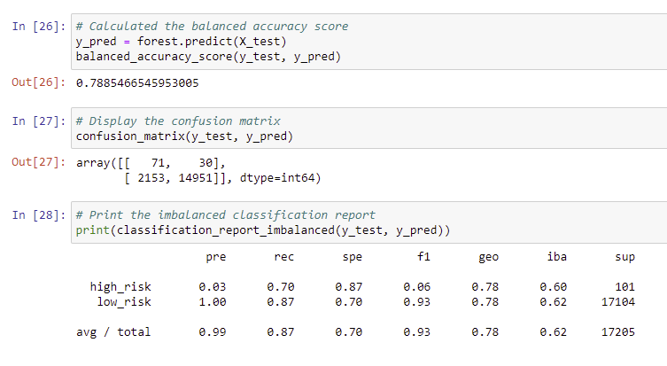

# Credit_Risk_Analysis

## Overview of the analysis

- This project aims to solve the challenge of credit card risk using dataset from LendingClub. Imbalanced-learn, scikit-learn libraries along with some algorithm will be used to evaluate the performance of models created from the dataset.

## Results

- RandomOverSampler algorithms:

The balance accuracy is 64%.
The high risk precision is 1% and the recall score is 69%        
The low risk precision is 100% and the recall score is 60% 

- SMOTE algorithms

The balance accuracy is 66%
The high risk precision is 1% and the recall score is 63%        
The low risk precision is 100% and the recall score is 69% 

- ClusterCentroids

The balance accuracy is 66%
The high risk precision is 1% and the recall score is 68%        
The low risk precision is 100% and the recall score is 41% 

- SMOTEENN

The balance accuracy is 55%
The high risk precision is 1% and the recall score is 72%        
The low risk precision is 100% and the recall score is 57% 

- BalancedRandomForestClassifier

The balance accuracy is 79%
The high risk precision is 3% and the recall score is 70%        
The low risk precision is 100% and the recall score is 87% 

- EasyEnsembleClassifier
 

The balance accuracy is 93%
The high risk precision is 9% and the recall score is 92%        
The low risk precision is 100% and the recall score is 94% 

##Summary

- The first four models don't show high number in balanced accuracy score with lower sensitivity
- The best one that might be recommened is the Easy Ensemble Classifier as it shows the highest numbers in balanced accuracy score, precision and recall score: 
