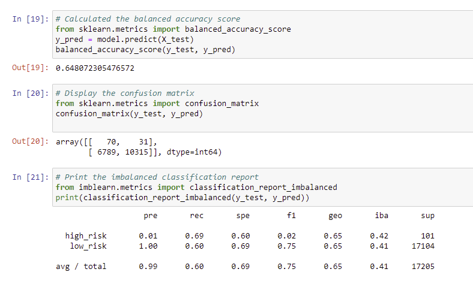
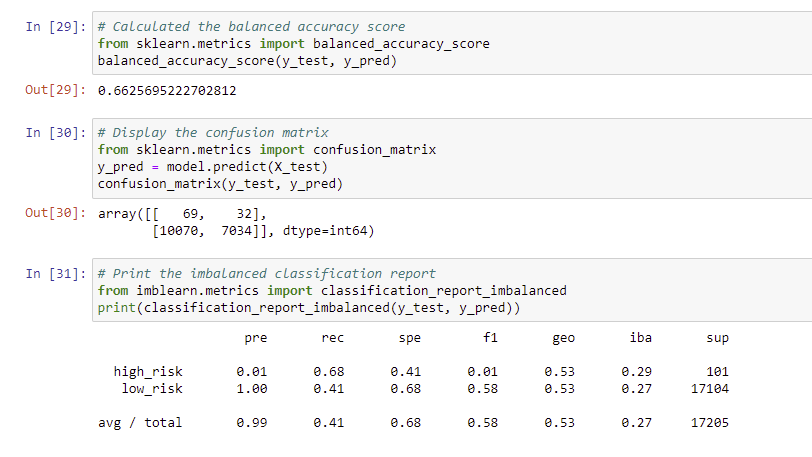

# Credit_Risk_Analysis

## Overview of the analysis

- This project aims to solve the challenge of credit card risk using dataset from LendingClub. Imbalanced-learn, scikit-learn libraries along with some algorithm will be used to evaluate the performance of models created from the dataset.

## Results
- RandomOverSampler algorithms

- SMOTE algorithms

- ClusterCentroids

- SMOTEENN

- BalancedRandomForestClassifier

- EasyEnsembleClassifier
- 

-
