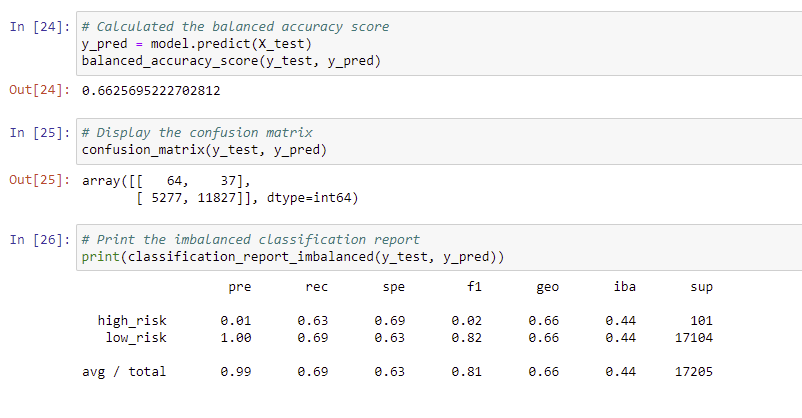
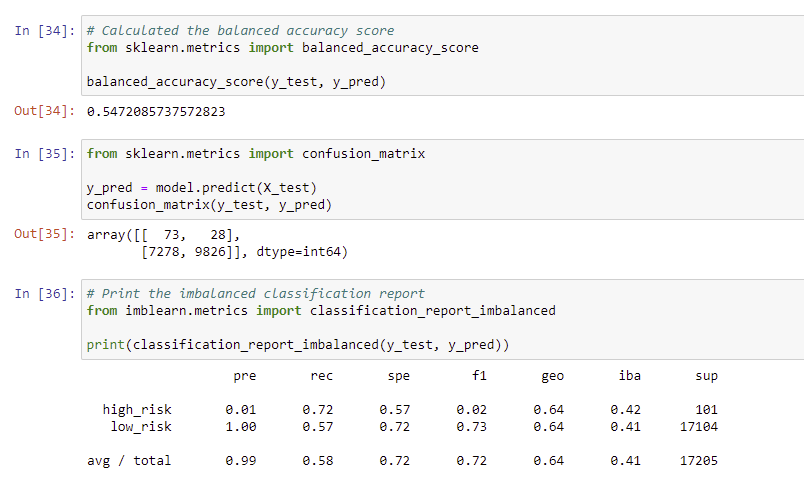
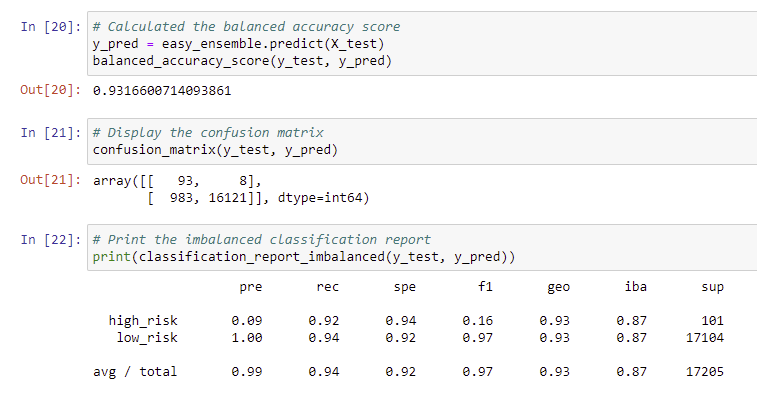

# Credit_Risk_Analysis

## Overview of the analysis

- This project aims to solve the challenge of credit card risk using dataset from LendingClub. Imbalanced-learn, scikit-learn libraries along with some algorithm will be used to evaluate the performance of models created from the dataset.

## Results
- RandomOverSampler algorithms:

The balance accuracy is
The high risk precision is       and the recall is        
The low risk precision is        and the recall is 

- SMOTE algorithms

The balance accuracy is
The high risk precision is       and the recall is        
The low risk precision is        and the recall is 

- ClusterCentroids

The balance accuracy is
The high risk precision is       and the recall is        
The low risk precision is        and the recall is 

- SMOTEENN

The balance accuracy is
The high risk precision is       and the recall is        
The low risk precision is        and the recall is 

- BalancedRandomForestClassifier

The balance accuracy is
The high risk precision is       and the recall is        
The low risk precision is        and the recall is 

- EasyEnsembleClassifier
 

The balance accuracy is
The high risk precision is       and the recall is        
The low risk precision is        and the recall is 
